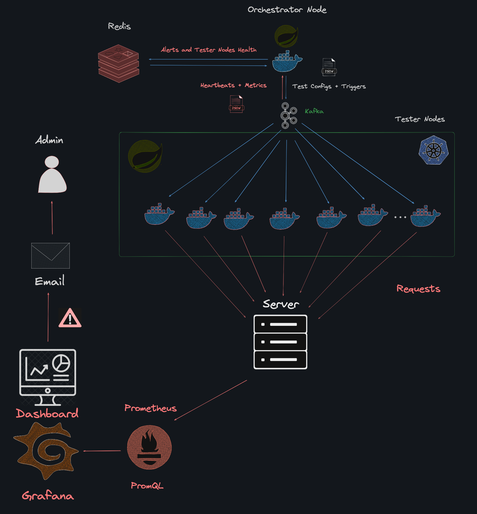

# 🚀 Distributed Load Testing System

Welcome to the Distributed Load Testing System, a powerful and scalable solution designed to conduct high-throughput load tests seamlessly. This project leverages cutting-edge technologies to simulate real-world scenarios and push the boundaries of your target server's performance.




## 🌟 Features

- 🔀 Integrated Kafka for real-time communication between the orchestrator and distributed tester nodes.
- ⚡ Implemented Java Threads and concurrency patterns for simultaneous execution of Avalanche and Tsunami load tests.
- 🐳 Leveraged Docker containers for orchestrator and tester nodes, enabling scalable and isolated deployment.
- 🌊 Utilized Kubernetes for dynamic scaling of tester nodes in a cluster, ensuring efficient resource utilization.
- 📈 Monitored target server performance using Prometheus and visualized key metrics on Grafana.

## 📝 Load Testing Project Specifications

- 💓 Heart Beat Logic in Java
- 🕊️ Kafka Messaging for heartbeats, triggers, register messages, and metrics
- 📊 Receiving meaty metrics and monitoring metrics of the target server using Prometheus
- 📺 Visualization of metrics of interest using Grafana with a customized dashboard
- 📬 Alerting system via mail for high load & CPU usage

## 🧩 Components

### 🎻 Orchestrator Node Tasks (Runs as a Springboot container)

- 🚀 Send Trigger messages to start/stop sending heartbeats
- 📝 Send Register messages to run Load Tests on a target server
- 📥 Receive metrics regarding mean, average, minimum, and maximum latency

### 🏭 Tester Nodes (Runs as a Springboot container)

- 💓 Send heartbeat messages periodically based on trigger message from the orchestrator
- 🌊 Send load to the target server based on the test configuration register message sent by the orchestrator
- 🔥 Can perform two types of tests: Avalanche or Tsunami
- 💧 Tsunami sends a request periodically one at a time with a specified customizable gap in between
- 🌪️ Avalanche floods the server with requests at the same time, testing the boundaries of the target server

### 🎯 Target Server

- 💻 This can be any Application Server that needs testing
- 📈 We configure it with Prometheus
- 📺 Visualize metrics using Grafana and send mail alerts to the respective team

**Note:** The entire project has been containerized end-to-end and is ready to scale! 🚀

## 🏃‍♂️ Getting Started

To get the backend up and running, follow these steps:

1. Clone the repository: `git clone https://github.com/arya-vinayak/LoadExpert.git`
2. Navigate to the backend folder: `cd backend`

Assuming you have your Kubernetes cluster ready with Docker, execute the following script:

```bash
./helmChart.sh

```

This script does the following:

- Installs KEDA (Kubernetes Event-driven Autoscaling) using Helm:
    
    ```bash
    helm install keda kedacore/keda
    
    ```
    
- Installs Prometheus using the Bitnami Helm chart with specific configurations:This command installs Prometheus with specific components enabled/disabled based on your requirements.
    
    ```bash
    helm install prometheus bitnami/kube-prometheus --set kubeEtcd.enabled=false \
      --set kubeScheduler.enabled=false \
      --set kubeControllerManager.enabled=false \
      --set kubeProxy.enabled=false \
      --set kubeStateMetrics.enabled=false \
      --set nodeExporter.enabled=false \
      --set prometheusOperator.enabled=true \
      --set alertmanager.enabled=false \
      --set grafana.enabled=false
    
    ```
    
1. Next, execute the `apply.sh` script to apply the necessary Kubernetes resources:

```bash
./apply.sh

```

This script does the following:

- Applies the ZooKeeper StatefulSet:
    
    ```bash
    kubectl apply -f zookeeper-statefulset.yaml
    
    ```
    
- Applies the Kafka StatefulSet:
    
    ```bash
    kubectl apply -f kafka-stateful.yaml
    
    ```
    
- Applies the Orchestrator Deployment:
    
    ```bash
    kubectl apply -f orchestrator-deployment.yaml
    
    ```
    
- Applies the Tester Deployment:
    
    ```bash
    kubectl apply -f tester-deployment.yaml
    
    ```
    
- Applies the Scaler Object for autoscaling the Tester Nodes:
    
    ```bash
    kubectl apply -f scaler-object.yaml
    
    ```
    

Wait for a minute or two, and your backend will be up and running! 🎉

You can host your backend using AWS, Azure, or any cloud platform you prefer. For a local setup with Kubernetes, you can use Ngrok for port forwarding the Orchestrator service.

```bash
kubectl port-forward service/orchestra 8082:8082

```
### ⚡ Ngrok Setup (for local development)

If you're running the backend locally using Kubernetes, you can use Ngrok to expose the Orchestrator service to the internet. Follow these steps:

1. Install Ngrok by following the instructions from the official website: https://ngrok.com/download
2. Run the following command to start Ngrok and expose the Orchestrator service on a custom domain:

```bash
ngrok http <domain-name> 8082

```

Replace `<domain-name>` with your desired subdomain name.

This sets up your backend completely. 💯

### 🖥️ Frontend Setup

Now, let's set up the frontend, which is a Next.js application.

1. Navigate to the frontend directory: `cd frontend`
2. Install the dependencies: `npm install`
3. Start the development server: `npm run dev`
4. Create a `.env` file and set the `NEXT_PUBLIC_SERVER_URL` environment variable with your backend URL:

```
NEXT_PUBLIC_SERVER_URL=<your-backend-url>

```

That's it! You're now ready to start load testing! 🎉

## 🤝 Contributing

Contributions are welcome! Please follow the [Contributing Guidelines](notion://www.notion.so/CONTRIBUTING.md) to get started.

## 📧 Contact

For any questions or inquiries, feel free to reach out to me at aryavinayak2003@gmail.com

Happy load testing! 🚀🔥